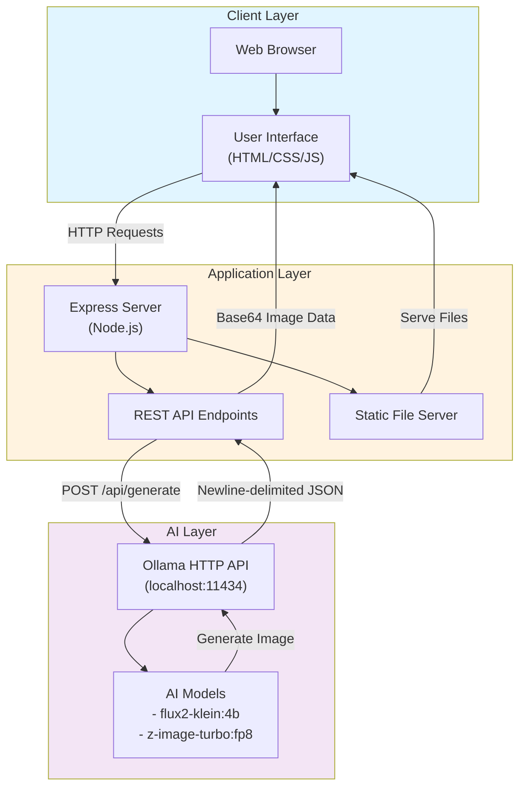
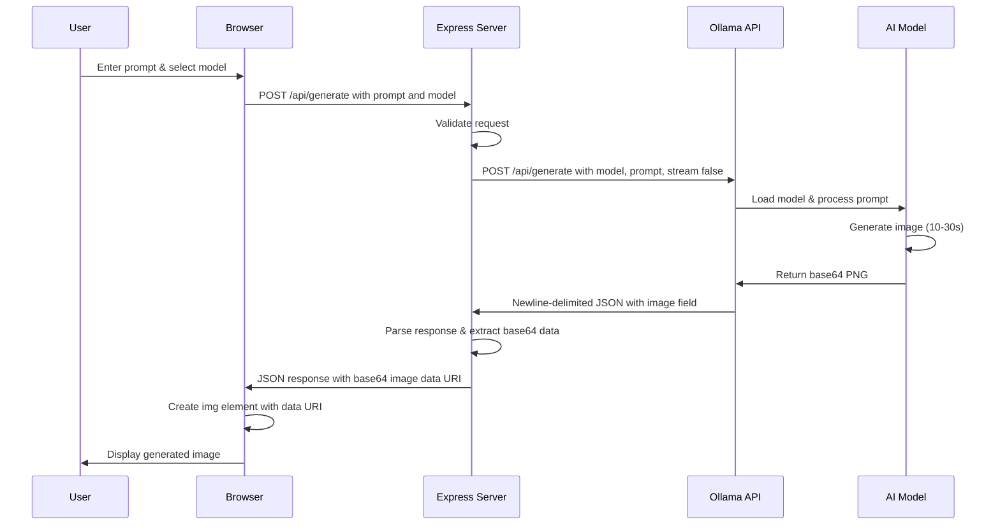
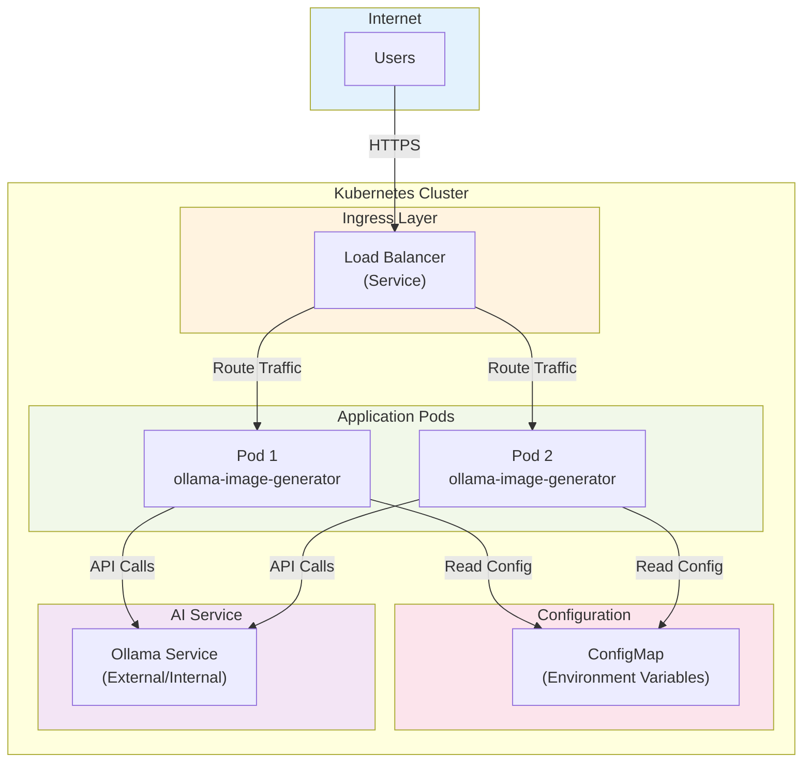
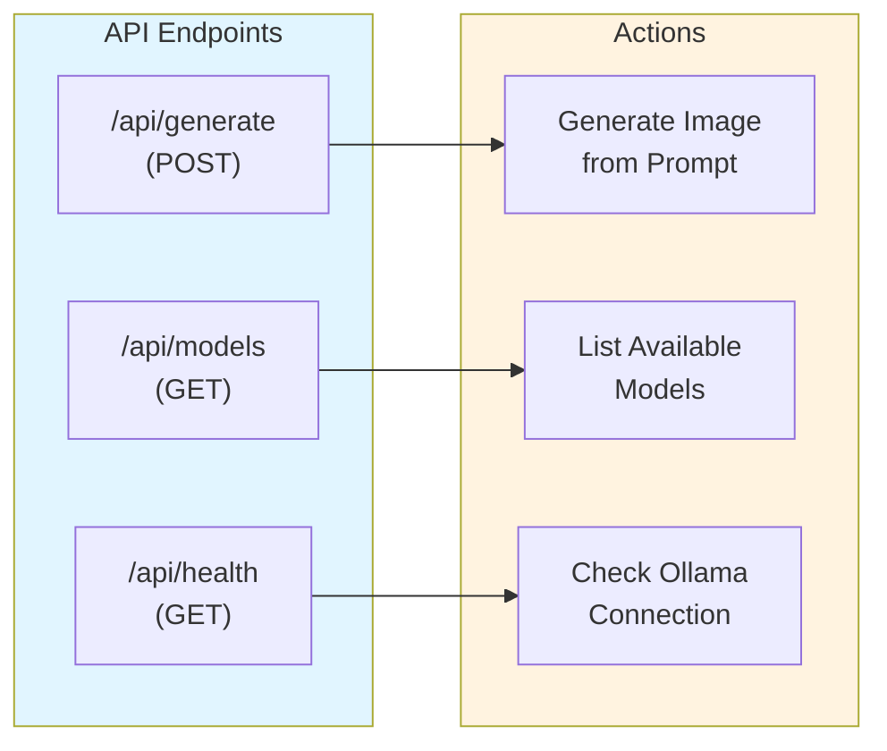
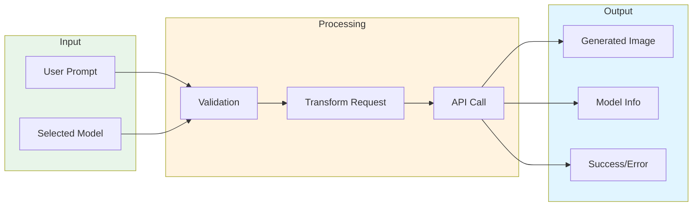
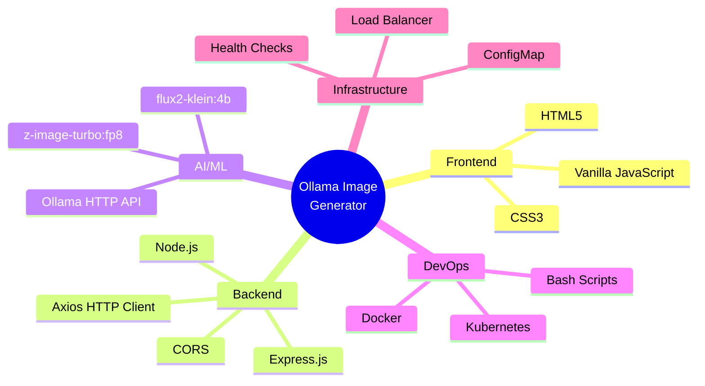
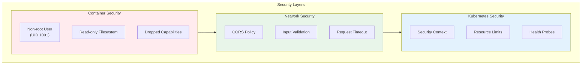
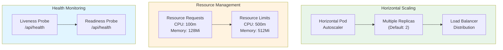

# Ollama Image Generator - Architecture

## System Architecture



## Component Flow



## Deployment Architecture



## API Endpoints



## Data Flow



## Technology Stack



## Security Architecture



## Scaling Strategy



## Key Features

- **HTTP API Integration**: Uses Ollama's HTTP API (`/api/generate`) for programmatic access
- **Stateless Design**: Application pods are stateless for easy scaling
- **Health Monitoring**: Liveness and readiness probes ensure reliability
- **Resource Management**: CPU and memory limits prevent resource exhaustion
- **Security**: Non-root containers with minimal privileges
- **High Availability**: Multiple replicas with load balancing
- **Configuration Management**: External configuration via ConfigMap
- **Graceful Degradation**: Health checks detect Ollama API availability

## Implementation Notes

### HTTP API Communication

The application uses Ollama's HTTP API for image generation:

**Request Format:**
```javascript
POST http://localhost:11434/api/generate
Content-Type: application/json

{
  "model": "x/flux2-klein:4b",
  "prompt": "a cat holding a sign that says hello world",
  "stream": false
}
```

**Response Format:**
- **Type**: Newline-delimited JSON (NDJSON)
- **Structure**: Multiple JSON objects, one per line
- **Final Response**: Contains `image` field with base64-encoded PNG

```json
{"model":"x/flux2-klein:4b","created_at":"...","response":"","done":false}
{"model":"x/flux2-klein:4b","created_at":"...","response":"","done":true,"image":"iVBORw0KGgo..."}
```

**Key Implementation Details:**
1. **Response Parsing**: Split by newlines, parse last line as JSON
2. **Image Field**: Singular `image` field (not `images` array)
3. **Base64 Encoding**: Image data is base64-encoded PNG
4. **Data URI**: Converted to `data:image/png;base64,{image}` for browser display
5. **Timeout**: 3 minutes (180 seconds) for generation
6. **Max Content Length**: 50MB to handle large images

**Supported Models:**
- `x/flux2-klein:4b` - High-quality image generation (slower)
- `x/z-image-turbo:fp8` - Fast image generation (faster)

**Error Handling:**
- Connection errors: Ollama service not running
- Timeout errors: Generation took too long
- Parse errors: Invalid response format
- Empty response: Model failed to generate